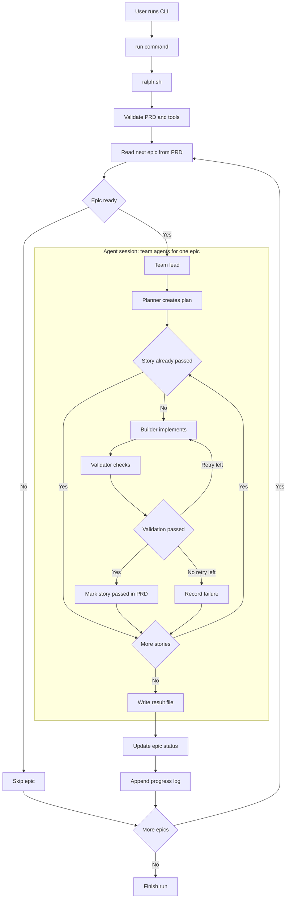

# ralph-teams

`ralph-teams` is a CLI for running Ralph Teams: a shell-based orchestrator that reads a `prd.json`, loops through epics, and spawns AI coding agent teams to implement work story by story.

## What It Does

The system has two layers:

- `ralph.sh` acts as the project manager. It validates the PRD, checks epic dependencies, loops through ready epics, records results, and updates progress files.
- A backend agent session handles one epic at a time using a small team:
  - `team-lead` coordinates the epic
  - `planner` creates the implementation plan
  - `builder` makes changes and runs tests
  - `validator` verifies the result independently

Ralph never writes code itself. It only schedules work, tracks results, and updates project state.

Current backends:

- `claude` via the `claude` CLI and `.claude/agents/*.md`
- `copilot` via `gh copilot` and `.github/agents/*.agent.md`

## Flow



## Requirements

- Node.js 18+
- `jq` in `PATH`
- Git available if you want Ralph to switch/create the target branch

Backend-specific requirements:

- Claude backend:
  - `claude` CLI in `PATH`
- Copilot backend:
  - `gh` CLI in `PATH`
  - GitHub Copilot CLI available through `gh copilot`

Install `jq` on macOS:

```bash
brew install jq
```

## Install

Install globally:

```bash
npm install -g ralph-teams
```

Or use it locally from this repo:

```bash
npm install
npm run build
npm link
```

Then verify:

```bash
ralph-teams --help
```

## Quick Start

1. Create a PRD:

```bash
ralph-teams init
```

2. Validate it:

```bash
ralph-teams validate
```

3. Inspect the planned work:

```bash
ralph-teams summary
ralph-teams status
```

4. Run Ralph:

```bash
ralph-teams run
```

5. Check progress:

```bash
ralph-teams logs
```

Run `ralph.sh` directly when you want to choose a backend:

```bash
./ralph.sh prd.json --backend claude
./ralph.sh prd.json --backend copilot
./ralph.sh prd.json --backend copilot --max-epics 1
```

## Commands

### `ralph-teams init`

Creates a new `prd.json` interactively in the current directory by launching an AI PRD-creator session.

```bash
ralph-teams init
ralph-teams init --backend claude
ralph-teams init --backend copilot
```

Flow:

1. `init` launches an interactive agent session
2. the agent discusses the product with you directly
3. the agent asks follow-up questions until the requirements are clear
4. the agent generates the full `prd.json` with project metadata, epics, and user stories
5. the agent writes `./prd.json`

Notes:

- `init` is grounded by `prd.json.example`
- the agent generates epics and user stories automatically
- the agent should aim for about 5 user stories per epic when the scope supports it
- `--backend` controls whether the interview/generation uses `claude` or `copilot`
- the discussion itself is handled by the agent, not by a hardcoded questionnaire in the CLI

### `ralph-teams run [path]`

Runs Ralph against a PRD file. Default path is `./prd.json`.

```bash
ralph-teams run
ralph-teams run ./my-prd.json
```

Behavior:

- validates that the default backend dependencies, `jq`, and the PRD are available
- locates bundled `ralph.sh`
- streams Ralph output directly to the terminal
- exits with Ralph's exit code

Notes:

- the CLI currently runs `ralph.sh` with its default backend
- if you want to force `claude` or `copilot`, run `ralph.sh` directly with `--backend`

### `ralph-teams status [path]`

Shows epic and story pass/fail state from a PRD.

```bash
ralph-teams status
ralph-teams status ./my-prd.json
```

### `ralph-teams logs [--tail N]`

Shows `progress.txt` with light colorization.

```bash
ralph-teams logs
ralph-teams logs --tail 20
```

### `ralph-teams reset <epicId> [path]`

Resets one epic to `pending` and sets all of its stories back to `passes: false`.

```bash
ralph-teams reset EPIC-002
```

### `ralph-teams add-epic [path]`

Interactively appends a new epic to an existing PRD.

```bash
ralph-teams add-epic
```

This command:

- creates the next `EPIC-###` id
- creates globally unique `US-###` ids across the PRD
- lets you choose dependencies from existing epics

### `ralph-teams validate [path]`

Validates PRD structure and dependency integrity.

```bash
ralph-teams validate
```

Checks include:

- required fields
- valid epic status values
- duplicate epic IDs
- duplicate story IDs
- unknown `dependsOn` references
- circular epic dependencies

### `ralph-teams summary [path]`

Prints a dependency-oriented overview of epics.

```bash
ralph-teams summary
```

Shows:

- dependency arrows
- epic status
- story pass counts
- blocked epics

## Backends

### Claude Backend

Uses:

- `claude` CLI
- `.claude/agents/`
- structured JSON streaming from the Claude CLI

Example:

```bash
./ralph.sh prd.json --backend claude
```

### Copilot Backend

Uses:

- `gh copilot`
- `.github/agents/`
- PTY-backed execution so live Copilot output is visible during runs

Example:

```bash
./ralph.sh prd.json --backend copilot
```

Notes:

- Copilot live output is routed through a PTY wrapper in `ralph.sh`
- without the PTY wrapper, `gh copilot` may not show incremental output in pipe mode

## PRD Format

Example:

```json
{
  "project": "MyApp",
  "branchName": "ralph/my-feature",
  "description": "Short description of the project",
  "epics": [
    {
      "id": "EPIC-001",
      "title": "Authentication",
      "description": "Add login and session handling",
      "status": "pending",
      "dependsOn": [],
      "userStories": [
        {
          "id": "US-001",
          "title": "Login form",
          "description": "As a user, I want to sign in",
          "acceptanceCriteria": [
            "User can submit email and password",
            "Validation errors are shown clearly"
          ],
          "priority": 1,
          "passes": false
        }
      ]
    }
  ]
}
```

Important fields:

- `epics[].status`: `pending` | `completed` | `partial` | `failed`
- `epics[].dependsOn`: epic IDs that must be completed first
- `userStories[].passes`: whether the story is currently marked as passing

Authoring guideline:

- aim for about 5 user stories per epic when the scope can be split cleanly
- use fewer only when the epic is genuinely small or further splitting would be artificial

The `init` command uses `prd.json.example` as schema and style guidance when generating a new PRD.

## Files Ralph Produces

During a run, Ralph writes:

- `progress.txt`: high-level run log
- `plans/plan-EPIC-xxx.md`: planner output for an epic
- `results/result-EPIC-xxx.txt`: final pass/partial/fail result per epic
- `logs/epic-EPIC-xxx-<timestamp>.log`: raw Claude session log

Ralph also updates the original `prd.json` in place as story and epic state changes.

The team lead agent log for each epic is written to `logs/` regardless of backend.

## Runtime Rules

The current execution contract is:

- Ralph loops through epics in PRD order
- blocked epics are skipped until dependencies are complete
- the backend team processes one epic per session
- stories run sequentially inside that epic
- already-passed stories are skipped
- each story gets at most two build/validate cycles
- the validator checks output independently from the builder's reasoning

## Troubleshooting

### `zsh: command not found: ralph-teams`

Install or relink the package:

```bash
npm install -g ralph-teams
```

Or from this repo:

```bash
npm link
```

### `Error: 'claude' CLI not found`

Install Claude Code and ensure `claude` is on your `PATH`.

### `Error: 'gh' CLI not found`

Install GitHub CLI and ensure `gh` is on your `PATH`.

### `Error: GitHub Copilot CLI not available`

Make sure `gh copilot` is installed and working:

```bash
gh copilot -- --version
```

### Copilot backend runs but shows no live output

This repo runs Copilot through a PTY wrapper in `ralph.sh` because plain pipe mode does not reliably stream visible output from `gh copilot`.

If output still looks stuck, test the backend directly:

```bash
./ralph.sh prd.json --backend copilot --max-epics 1
```

If that still does not stream, the issue is likely in the local `gh copilot` environment rather than the CLI wrapper.

Install Claude Code and ensure `claude` is on your `PATH`.

### `Error: 'jq' not found`

Install `jq`:

```bash
brew install jq
```

### Ralph cannot switch branches

`ralph.sh` refuses to switch branches if the worktree is dirty. Commit or stash your changes first.

## Development

Useful commands in this repo:

```bash
npm run build
npm run typecheck
npm link
```

The packaged CLI entrypoint is `dist/index.js`, and the runtime orchestrator is `ralph.sh`.
