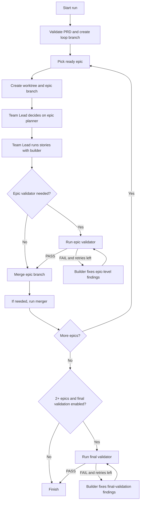

# ralph-teams


`ralph-teams` is a lightweight and budgetfriendly CLI for running Ralph Teams: a shell-based orchestrator that initializes and reads a `prd.json`, loops through epics (not user stories), and spawns AI coding agent teams to implement work story by story. One Agent Team per Epic with fresh context. Ralph-Teams can even work on multiple epics in parallel, if there are no dependencies
```bash
ralph-teams run --parallel={max_parallel_epics}
```

## Quickest Start

```bash
npm install -g ralph-teams

# discuss with an agent and create the prd.json (epics and user stories)
ralph-teams init

# start the loop, by default uses claude
ralph-teams run
```

## Flow

This diagram shows the default `balanced` workflow only.



Other presets:

- `full`: adds optional story planner and optional story validator decisions inside each epic.
- `minimal`: disables planner and validator subagent stages. The Team Lead still coordinates builders and records per-story pass/fail results.

## What It Does

The system has two layers:

- `ralph.sh` acts as the project manager. It validates the PRD, checks epic dependencies, loops through ready epics, records results, and updates progress files.
- `ralph.sh` also prepares each epic worktree to be runnable before the Team Lead starts. For lockfile-backed Node projects, it bootstraps dependencies inside the worktree and skips reinstall on reused worktrees when the lockfile is unchanged.
- A backend agent session handles one epic at a time using a small team:
  - `team-lead` coordinates the epic
  - `epic-planner` creates the implementation plan when epic planning is enabled
  - `story-planner` creates a story-scoped plan when story planning is enabled
  - `builder` makes changes and runs tests
  - `story-validator` verifies a single story when story validation is enabled
  - `epic-validator` verifies the full epic when epic validation is enabled and the Team Lead decides independent epic-level verification is warranted
  - `final-validator` verifies the merged result in multi-epic runs when final validation is enabled
  - `merger` resolves merge conflicts when they occur

Scoped planning and validation are configurable via `ralph.config.yml`. Workflow presets provide sensible defaults:
- `balanced`: epic planning enabled and heuristic epic validation enabled
- `full`: `balanced`, plus story planning and heuristic story validation
- `minimal`: planning and validation toggles disabled; no planner or validator subagents are spawned

Validation semantics:
- `storyValidation.enabled = 0` does not mean "no validation". It means no separate `story-validator` agent is spawned. The Team Lead performs the acceptance check inline so each story still has a gate before it can be marked passed.
- `epicValidation.enabled = 0` means no separate epic-level validation gate is spawned. Story acceptance still happens, but there is no additional independent epic validator pass.
- This asymmetry is intentional. Story work always needs an acceptance decision to drive the Builder retry loop and update per-story state. Epic validation is a higher-level quality gate that can be turned off entirely when you want a faster loop.
- `storyValidation.maxFixCycles` and `epicValidation.maxFixCycles` control retries after the first attempt. `0` means one total attempt and no retry cycle. The Team Lead can still mark the work failed, but cannot push it back for another Builder pass.

Across all backends, `builder` work is one-shot per attempt. A build attempt only counts when the Builder returns a concrete commit SHA and the Team Lead persists the story result to the epic state file at `.ralph-teams/state/{epic-id}.json`.

Default agent model assignments:
- `teamLead`: `opus`
- `epicPlanner`: `opus`
- `epicValidator`: `opus`
- `finalValidator`: `opus`
- `builder`: `sonnet`
- `storyValidator`: `sonnet`
- `storyPlanner`: `opus`
- `merger`: `sonnet`

Team Lead policy by backend:
- Claude: keep `team-lead` on `opus`; for spawned work, the Team Lead chooses `haiku` for easy tasks, `sonnet` for medium tasks, `opus` for difficult tasks
- Copilot: difficulty-based defaults use `claude-haiku-4.5`, `claude-sonnet-4.6`, and `claude-opus-4.6`
- Codex: difficulty-based defaults use `gpt-5-mini`, `gpt-5.3-codex`, and `gpt-5.4`

If `ralph.config.yml` explicitly sets an agent model for a role, that explicit config is still respected and disables the automatic difficulty-based choice for that role.

Configuration precedence, highest priority first:
- CLI flags override config for the fields they control today: `run --backend` beats `execution.backend`, and `run --parallel` beats `execution.parallel`.
- In `ralph.config.yml`, explicit per-role `agents.<role>` entries beat `execution.model` for that role.
- In `ralph.config.yml`, `execution.model` beats the built-in per-role defaults and is treated as an explicit model choice for every role.
- In `ralph.config.yml`, explicit `execution.*` fields beat the selected workflow preset for those same execution settings.
- In `ralph.config.yml`, `workflow.preset` beats the built-in defaults by seeding the planning/validation toggles.
- Built-in defaults in `src/config.ts` apply last when nothing else overrides them.

Model precedence, ranked:
1. `agents.<role>`
2. `execution.model`
3. backend difficulty-based auto-selection, but only when there is no explicit model override for that role
4. built-in config defaults

Notes:
- `agents.planner` and `agents.validator` are legacy aliases. They only apply when `agents.epicPlanner` or `agents.storyValidator` are not set.
- `execution.model` counts as explicit for all roles, so Ralph will not replace it later with the Team Lead's difficulty-based model selection.

Ralph never writes code itself. It only schedules work, tracks results, and updates project state.

Current backends:

- `claude` via the `claude` CLI and `.claude/agents/*.md`
- `copilot` via `gh copilot` and `.github/agents/*.agent.md`
- `codex` via the `codex` CLI, repo-local `.codex/agents/*.toml`, and Codex multi-agent mode
- `opencode` via the `opencode` CLI and `.opencode/agents/*.md`
- shared worker-agent prompt source in `prompts/agents/*.md`, rendered to those backend-specific files via `npm run sync:agents`

The runtime is file-based. During a run, Ralph treats these files as the working state of the system:

- `prd.json`: source of truth for epic dependencies and status
- `.ralph-teams/state/`: per-epic story pass/fail state files
- `.ralph-teams/plans/`: implementation plans for epics that were explicitly planned
- `.ralph-teams/progress.txt`: narrative progress log
- `.ralph-teams/logs/`: raw backend logs
- `.ralph-teams/ralph-state.json`: interrupt/resume state

Final validation artifacts:
- `.ralph-teams/logs/final-validation-<run-id>.log`: shell-owned raw final-validation output. This is the file the final Builder reads if final validation fails and a fix cycle is needed.
- `.ralph-teams/state/final-validation-result-<run-id>.json`: machine-readable final-validation verdict for Ralph's control flow.
- Ralph intentionally keeps the raw log shell-owned so the validator cannot overwrite it.


## Requirements

- Node.js 18+
- Git available if you want Ralph to switch/create the target branch

Backend-specific requirements:

- Claude backend:
  - `claude` CLI in `PATH`
- Copilot backend:
  - `gh` CLI in `PATH`
  - GitHub Copilot CLI available through `gh copilot`
- Codex backend:
  - `codex` CLI in `PATH`
  - multi-agent feature enabled by the CLI (Ralph passes `--enable multi_agent` automatically)
- OpenCode backend:
  - `opencode` CLI in `PATH`

## Install

Install globally:

```bash
npm install -g ralph-teams
```

Or use it locally from this repo:

```bash
npm install
npm run build
npm link
```

Then verify:

```bash
ralph-teams --help
rjq --help
```

## Start

1. Create a PRD:

```bash
ralph-teams init
```

2. Validate it:

```bash
ralph-teams validate
```

3. Inspect the planned work:

```bash
ralph-teams summary
ralph-teams status
```

4. Run Ralph:

```bash
ralph-teams run
```

5. Check progress:

```bash
ralph-teams logs
```

Run `ralph.sh` directly when you want shell-level flags:

```bash
./ralph.sh prd.json --backend claude
./ralph.sh prd.json --backend copilot
./ralph.sh prd.json --backend codex
./ralph.sh prd.json --parallel 2
./ralph.sh prd.json --backend copilot --max-epics 1
```

## Commands

### `ralph-teams setup`

Runs interactive setup to create or update `ralph.config.yml` for your repository.

```bash
ralph-teams setup
```

Prompts for:
- Default backend (`claude`, `copilot`, `codex`, `opencode`)
- Planning/validation workflow setup: use a preset or configure each planning and validation step manually
- Workflow preset (`balanced`, `full`, `minimal`) with short inline explanations during setup
- Parallel epic execution and max parallel epics
- Overall loop timeout
- Agent model overrides (optional)

Workflow presets:
- `balanced`: epic planning enabled and heuristic epic validation enabled
- `full`: `balanced`, plus story planning and heuristic story validation
- `minimal`: planning and validation toggles disabled; no planner or validator subagents are spawned

Preset behavior notes:
- `balanced` does not enable final validation by default.
- `minimal` still lets the Team Lead validate stories inline and mark them passed or failed; it only disables the separate planner/validator subagent stages.

### `ralph-teams init`

Creates a new `prd.json` interactively in the current directory by launching an AI PRD-creator session. If `ralph.config.yml` does not already exist, `init` first runs interactive setup so you can configure Ralph for the repository.

```bash
ralph-teams init
ralph-teams init --backend claude
ralph-teams init --backend copilot
ralph-teams init --backend codex
ralph-teams init --backend opencode
```

Flow:

1. `init` launches an interactive agent session
2. the agent discusses the product with you directly
3. the agent asks follow-up questions until the requirements are clear
4. the agent generates the full `prd.json` with project metadata, epics, and user stories
5. if `./ralph.config.yml` is missing, `init` first runs `ralph-teams setup` interactively and writes the chosen config
6. the agent writes `./prd.json`
7. after writing the PRD, the init agent can either continue into implementation planning with you or stop there if you want to skip planning for now

Notes:

- `init` is grounded by `prd.json.example`
- `init` does not overwrite an existing `ralph.config.yml`
- `setup` lets you choose the default backend, use a planning/validation workflow preset or configure that workflow manually, set parallelism, and optionally override per-role models
- the agent generates epics and user stories automatically
- the agent should aim for about 5 user stories per epic when the scope supports it
- `--backend` controls whether the interview/generation uses `claude`, `copilot`, `codex`, or `opencode`
- the discussion itself is handled by the agent, not by a hardcoded questionnaire in the CLI

### `ralph-teams run [path]`

Runs Ralph against a PRD file. Default path is `./prd.json`.

```bash
ralph-teams run
ralph-teams run ./my-prd.json
ralph-teams run --backend copilot
ralph-teams run --backend codex
ralph-teams run --parallel 2
```

Behavior:

- validates that the selected backend dependencies, `rjq`, and the PRD are available
- locates bundled `ralph.sh`
- streams Ralph output directly to the terminal
- exits with Ralph's exit code

Notes:

- `--backend` is forwarded to `ralph.sh`
- runs sequentially by default
- `--parallel <n>` enables the experimental parallel wave runner

Planning behavior:

- if an epic has `planned: true`, the Team Lead is expected to read `.ralph-teams/plans/plan-EPIC-xxx.md` and follow it
- if an epic is still unplanned and epic planning is enabled, medium- and high-complexity epics should spawn the epic planner before implementation
- only clearly low-complexity epics should skip planning during execution

### `ralph-teams task <prompt>`

Runs an ad hoc task in the current repository without creating a PRD, epic, or story structure.

```bash
ralph-teams task "fix the flaky auth test"
ralph-teams task "add rate limiting to login" --backend codex
```

Behavior:

- requires a checked out git branch and runs on that same branch
- asks once whether you want to plan the task first
- if you choose planning, starts a guided planning session with the agent
- otherwise starts direct Team Lead execution for the task

Notes:

- this mode does not create `prd.json` entries or worktrees
- `--backend` controls whether the task uses `claude`, `copilot`, or `codex`

### `ralph-teams plan [path]`

Starts a guided planning discussion for epics that are not yet marked as planned. Default path is `./prd.json`.

```bash
ralph-teams plan
ralph-teams plan ./my-prd.json
ralph-teams plan --backend claude
```

Behavior:

- loads epics with `planned !== true`
- starts an interactive agent discussion about implementation approach and sequencing
- asks the agent to write `.ralph-teams/plans/plan-EPIC-xxx.md`
- asks the agent to mark each agreed epic as `planned: true` in `prd.json`

Notes:

- this command is intended after `ralph-teams init`
- if you skip an epic during planning, it remains `planned: false`
- planned epics should not require the Team Lead to spawn another epic planner later

### `ralph-teams resume`

Resumes an interrupted run from `./.ralph-teams/ralph-state.json`.

```bash
ralph-teams resume
```

Behavior:

- reloads the saved PRD path, backend, and parallel settings
- reuses the current project config for timeouts and workflow settings
- restarts `ralph.sh`
- removes `.ralph-teams/ralph-state.json` after a successful resume

### `ralph-teams status [path]`

Shows epic and story pass/fail state from a PRD.

```bash
ralph-teams status
ralph-teams status ./my-prd.json
```

### `ralph-teams logs [--tail N]`

Shows `.ralph-teams/progress.txt` with light colorization.

```bash
ralph-teams logs
ralph-teams logs --tail 20
```

`--tail` shows the last `N` wave blocks from `.ralph-teams/progress.txt`.

### `ralph-teams reset [epicId] [path]`

Resets one epic to `pending` and sets all of its stories back to `passes: false`. When no epic ID is provided, resets all epics.

```bash
ralph-teams reset EPIC-002
ralph-teams reset          # resets all epics
```

### `ralph-teams validate [path]`

Validates PRD structure and dependency integrity.

```bash
ralph-teams validate
```

Checks include:

- required fields
- valid epic status values
- duplicate epic IDs
- duplicate story IDs
- invalid `dependsOn` values
- unknown `dependsOn` references
- circular epic dependencies

### `ralph-teams summary [path]`

Prints a dependency-oriented overview of epics.

```bash
ralph-teams summary
```

Shows:

- dependency arrows
- epic status
- story pass counts
- blocked epics

## Backends

### Claude Backend

Uses:

- `claude` CLI
- canonical worker prompts in `prompts/agents/`
- `.claude/agents/`
- structured JSON streaming from the Claude CLI

Example:

```bash
./ralph.sh prd.json --backend claude
```

### Copilot Backend

Uses:

- `gh copilot`
- canonical worker prompts in `prompts/agents/`
- `.github/agents/`
- PTY-backed execution so live Copilot output is visible during runs

Example:

```bash
./ralph.sh prd.json --backend copilot
```

Notes:

- Copilot live output is routed through a PTY wrapper in `ralph.sh`
- without the PTY wrapper, `gh copilot` may not show incremental output in pipe mode
- Copilot difficulty-based defaults now use GPT-family models: `gpt-5-mini`, `gpt-5.3-codex`, and `gpt-5.4`

### Codex Backend

Uses:

- `codex exec`
- canonical worker prompts in `prompts/agents/`
- `.codex/agents/*.toml`
- Codex multi-agent mode with repo-local scoped planner, builder, and validator roles

Example:

```bash
./ralph.sh prd.json --backend codex
```

Notes:

- Ralph enables Codex multi-agent mode per run, so no global `~/.codex/config.toml` edits are required
- Codex runs from each epic worktree and is granted write access to the repo root so it can update the shared PRD
- Codex does not use a separate repo-local Team Lead role file; the Team Lead policy comes from the runtime prompt assembled in `ralph.sh`, while `.codex/agents/*.toml` define the spawned story-planner, epic-planner, builder, story-validator, epic-validator, final-validator, and merger roles
- Codex follows the same scoped planning/validation contract as Claude and Copilot; the runtime prompt in `ralph.sh` enforces that policy for Codex Team Leads
- Edit `prompts/agents/*.md` and run `npm run sync:agents` to regenerate the backend-specific worker agent files

### OpenCode Backend

Uses:

- `opencode` CLI
- canonical worker prompts in `prompts/agents/`
- `.opencode/agents/`

Example:

```bash
./ralph.sh prd.json --backend opencode
```

## PRD Format

Example:

```json
{
  "project": "MyApp",
  "branchName": "main",
  "description": "Short description of the project",
  "epics": [
    {
      "id": "EPIC-001",
      "title": "Authentication",
      "description": "Add login and session handling",
      "status": "pending",
      "planned": false,
      "dependsOn": [],
      "userStories": [
        {
          "id": "US-001",
          "title": "Login form",
          "description": "As a user, I want to sign in",
          "acceptanceCriteria": [
            "User can submit email and password",
            "Validation errors are shown clearly"
          ],
          "priority": 1,
          "passes": false,
          "failureReason": null
        }
      ]
    }
  ]
}
```

Important fields:

- `epics[].status`: `pending` | `completed` | `partial` | `failed` | `merge-failed`
- `epics[].planned`: whether the implementation plan for this epic has already been created and agreed
- `epics[].dependsOn`: epic IDs that must be completed first
- `userStories[].passes`: whether the story is currently marked as passing
- `userStories[].failureReason`: short reason for the latest failed attempt, or `null`

Authoring guideline:

- aim for about 5 user stories per epic when the scope can be split cleanly
- use fewer only when the epic is genuinely small or further splitting would be artificial

The `init` command uses `prd.json.example` as schema and style guidance when generating a new PRD.

## Files Ralph Produces

During a run, Ralph writes:

- `.ralph-teams/progress.txt`: high-level run log
- `.ralph-teams/.worktrees/EPIC-xxx/`: isolated git worktree for an active epic
- `.ralph-teams/state/EPIC-xxx.json`: per-epic story pass/fail state (Team Lead reads/writes)
- `.ralph-teams/plans/plan-EPIC-xxx.md`: epic-planner output for an epic
- planned epics are expected to use these files as their implementation contract
- `.ralph-teams/logs/epic-EPIC-xxx-<timestamp>.log`: raw backend session log
- `.ralph-teams/ralph-state.json`: saved interrupt/resume state

Ralph also updates the original `prd.json` in place as epic status changes.

The team lead agent log for each epic is written to `.ralph-teams/logs/` regardless of backend.

## Runtime Rules

The current execution contract is:

- Ralph loops through epics in PRD order
- blocked epics are skipped until dependencies are complete
- runs sequentially by default
- experimental wave parallelism is enabled only with `--parallel <n>`
- at run start Ralph auto-commits any dirty worktree changes, then creates a fresh loop branch from your current branch
- each epic gets its own worktree and branch rooted from that loop branch
- before the Team Lead starts, Ralph bootstraps lockfile-backed Node projects inside the worktree so tests and local tooling can run there
- reused worktrees skip dependency reinstall when the worktree lockfile checksum is unchanged
- when an epic completes, its branch is merged back into the loop branch
- the backend team processes one epic per session
- stories run sequentially inside that epic
- already-passed stories are skipped
- rerunning Ralph automatically resets `failed` and `partial` epics back to `pending` so only unfinished work is retried
- each story gets at most two build/validate cycles
- Builder and Validator are one-shot story-scoped workers, never long-lived mailboxes shared across stories
- a Builder attempt only counts when the Team Lead receives a concrete commit SHA for that story attempt
- scoped validators check output independently from the builder's reasoning
- the Team Lead is expected to delegate early and not inspect the codebase beyond the minimum needed before delegation
- `DONE: X/Y stories passed` is a required session footer, but the durable completion signal is the epic state file updated by the Team Lead
- after updating the epic state file for all attempted stories, the team lead must print `DONE: X/Y stories passed` and exit the session immediately
- pressing `Ctrl-C` writes `.ralph-teams/ralph-state.json` so the run can be resumed later with `ralph-teams resume`

## Troubleshooting

### `zsh: command not found: ralph-teams`

Install or relink the package:

```bash
npm install -g ralph-teams
```

Or from this repo:

```bash
npm link
```

The package also installs `rjq`, which `ralph.sh` uses internally.

### `Error: 'claude' CLI not found`

Install Claude Code and ensure `claude` is on your `PATH`.

### `Error: 'gh' CLI not found`

Install GitHub CLI and ensure `gh` is on your `PATH`.

### `Error: 'codex' CLI not found`

Install Codex CLI and ensure `codex` is on your `PATH`.

### `Error: 'opencode' CLI not found`

Install OpenCode CLI and ensure `opencode` is on your `PATH`.

### `Error: GitHub Copilot CLI not available`

Make sure `gh copilot` is installed and working:

```bash
gh copilot -- --version
```

### Copilot backend runs but shows no live output

This repo runs Copilot through a PTY wrapper in `ralph.sh` because plain pipe mode does not reliably stream visible output from `gh copilot`.

If output still looks stuck, test the backend directly:

```bash
./ralph.sh prd.json --backend copilot --max-epics 1
```

If that still does not stream, the issue is likely in the local `gh copilot` environment rather than the CLI wrapper.

Install Claude Code and ensure `claude` is on your `PATH`.

### `Error: 'rjq' not found`

Install or relink the package so the bundled JSON CLI is on your `PATH`:

```bash
npm install -g ralph-teams
```

### Ralph needs to switch branches but the worktree is dirty

Ralph auto-commits current changes before creating or switching to the loop branch. If you do not want that commit, clean up the worktree yourself before starting the run.

## Development

Useful commands in this repo:

```bash
npm run build
npm run typecheck
npm test
npm link
```

Packaged binaries:

- `ralph-teams`: main CLI entrypoint (`dist/index.js`)
- `rjq`: bundled JSON query/manipulation CLI used by `ralph.sh` (`dist/json-tool.js`)

The runtime orchestrator is `ralph.sh`.
