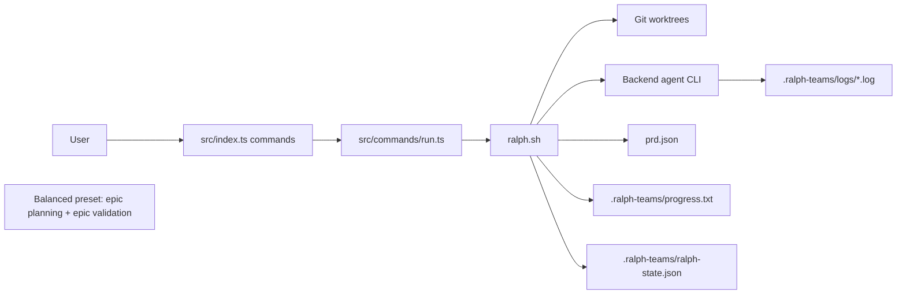

# Ralph Teams Architecture

## Overview

`ralph-teams` is a hybrid Bash + TypeScript system for orchestrating AI agent teams against a mutable `prd.json`.

The architecture is intentionally split:

- The Node CLI is the control plane for user-facing commands, config loading, validation, planning, and stats.
- `ralph.sh` is the execution engine. It owns the run loop, git worktrees, backend process lifecycle, timeouts, merges, and resume state, while delegating structured PRD/state mutations to `src/runtime-tool.ts`.
- `ralph.sh` creates each epic worktree and passes repo inspection, setup, build, and test command inference to the agents running inside it.
- External agent CLIs (`claude`, `gh copilot`, `codex`) do the implementation work. This repo provides prompts, agent role definitions, and orchestration around them.

The most important design choice is that `prd.json` is not just input. It becomes mutable runtime state:

- story `passes` flags record story-level completion
- story `failureReason` fields capture the latest failed attempt at story level
- epic `status` records orchestration outcome
- epic `planned` records whether the implementation plan has already been agreed and saved
- dependency resolution is evaluated directly from current PRD state

Everything else is either a derived view or a recovery artifact.

## High-Level Runtime

## Main Layers

### 1. CLI layer

Entry point: `src/index.ts`

Responsibilities:

- defines commands with `commander`
- dispatches to focused command modules in `src/commands`
- keeps most command handlers thin

Important commands:

- `setup`: `src/commands/setup.ts`
- `run`: `src/commands/run.ts`
- `resume`: `src/commands/resume.ts`
- `task`: `src/commands/task.ts` — ad hoc task planning and execution (non-PRD workflow)
- `init`: `src/commands/init.ts`
- `plan`: `src/commands/plan.ts`
- `validate`: `src/commands/validate.ts`
- `status`, `summary`, `logs`, `reset`

The CLI does not directly implement epic execution. It either prepares inputs for `ralph.sh` or renders derived views over files that `ralph.sh` maintains.

### Ad hoc task mode

The `task` command (`src/commands/task.ts`) provides an alternative execution path for one-off work outside the PRD/epic workflow:

- Interactive prompt for planning or execution
- Optional planning phase with guided scoping
- Direct execution mode for simple, unambiguous tasks
- Backend-agnostic task runtime with model selection
- Respects `ralph.config.yml` backend and agent model overrides
- Runs in current working directory on current branch (no branch switching)

Task execution uses the same backend agents as epic runs but skips the full PRD orchestration layer.

### 2. Execution engine

Main file: `ralph.sh`

This is the operational core of the project. It is responsible for:

- validating backend dependencies and the PRD
- creating the loop branch and dedicated loop worktree
- creating one git worktree per active epic
- deriving one run-scoped epic branch per active epic under `ralph/epic/<loop-run>/<epic-id>`
- spawning the team lead agent for each epic
- enforcing epic timeout, idle timeout, and overall loop timeout
- reading and mutating `prd.json`
- writing progress and resume artifacts
- enforcing the merge-result artifact contract and recovering leftover merges when needed

The Bash layer is stateful and process-oriented. That is why it owns:

- PID tracking
- trap handlers
- child process cleanup
- polling for log output and PRD progress
- merge conflict handling

### 3. Domain and utility modules

Core shared modules:

- `src/prd-utils.ts`: PRD types and simple load/save helpers
- `src/config.ts`: `ralph.config.yml` parsing, validation, defaults, CLI override merge, workflow presets
- `src/token-parser.ts`: backend log token extraction
- `src/commands/setup.ts`: interactive repository configuration
- `src/commands/plan.ts`: guided epic planning entrypoint and prompt builder
- `src/discuss.ts`: shared agent spawning and discussion helpers
- `src/runtime-tool.ts`: PRD validation, epic-state projection, resume snapshot writing, and other structured runtime mutations invoked from `ralph.sh`
- `src/runtime-env.ts` / `src/runtime-paths.ts`: shared runtime env and path contracts between the CLI and shell layers

Workflow presets in `ralph.config.yml`:

- `balanced`: epic planning + epic validation enabled, no final validation (default)
- `full`: all planning and validation toggles enabled (including final validation)
- `minimal`: all planning and validation toggles disabled

Validation semantics are intentionally asymmetric:

- when `storyValidation.enabled = 0`, the Team Lead still performs the story acceptance check inline so each story retains a pass/fail gate
- when `epicValidation.enabled = 0`, Ralph skips the independent epic-level validation gate entirely
- `maxFixCycles = 0` means one total attempt and no retry cycle after a failed validation decision

Legacy preset names (`default`, `thorough`, `off`, `epic-focused`) are accepted for backward compatibility and normalized to their current equivalents.

Configuration precedence is:

1. CLI overrides such as `--backend` and `--parallel`
2. role-specific `agents.<role>` values in `ralph.config.yml`
3. shared `execution.model` in `ralph.config.yml`
4. explicit `execution.*` values in `ralph.config.yml`
5. `workflow.preset`
6. built-in defaults from `src/config.ts`

Important nuance:

- `execution.model` is expanded into every role and treated as explicit for runtime model-selection purposes
- `agents.<role>` still overrides that shared model for the matching role
- if a role has no explicit model override, Ralph can still fall back to backend-specific difficulty-based selection at runtime
- legacy aliases `agents.planner` and `agents.validator` only apply when the modern role-specific fields are absent

These modules are mostly synchronous and file-oriented. That matches the rest of the codebase, which prefers simple filesystem contracts over in-memory services.

## Execution Lifecycle

### `run`

`src/commands/run.ts` performs the Node-side setup:

1. Resolve the PRD path.
2. Load `ralph.config.yml` through `src/config.ts`.
3. Merge CLI overrides such as `--backend` and `--parallel`.
4. Validate that the selected backend CLI exists.
5. Locate `ralph.sh`.
6. Run it directly with inherited stdio.

The command passes runtime settings to `ralph.sh` via environment variables:

- `RALPH_EPIC_TIMEOUT`
- `RALPH_IDLE_TIMEOUT`
- `RALPH_LOOP_TIMEOUT`
- `RALPH_STORY_PLANNING_ENABLED`
- `RALPH_STORY_VALIDATION_ENABLED`
- `RALPH_STORY_VALIDATION_MAX_FIX_CYCLES`
- `RALPH_EPIC_PLANNING_ENABLED`
- `RALPH_EPIC_VALIDATION_ENABLED`
- `RALPH_EPIC_VALIDATION_MAX_FIX_CYCLES`
- `RALPH_FINAL_VALIDATION_ENABLED`
- `RALPH_FINAL_VALIDATION_MAX_FIX_CYCLES`
- `RALPH_PARALLEL`
- `RALPH_BACKEND`
- per-role model env vars such as `RALPH_MODEL_TEAM_LEAD` and `RALPH_MODEL_BUILDER`

### `ralph.sh`

The shell runtime then:

1. Validates the PRD structure with `rjq`.
2. Detects circular dependencies.
3. Auto-commits any dirty worktree changes.
4. Establishes the run loop branch in a dedicated loop worktree.
5. Fails fast if the current loop branch already contains stale merge history for a pending run-scoped epic branch.
6. Normalizes retryable PRD state.
7. Repeatedly computes the next wave of runnable epics.
8. Creates or reuses each epic worktree and initializes the per-epic state file.
9. Spawns each epic in its own worktree and backend process.
10. Watches logs, timeout thresholds, PRD progress, and merge-result artifacts.
11. Updates `prd.json`, `.ralph-teams/progress.txt`, and stats after completion.
12. Recovers leftover completed-but-unmerged epic branches when resuming or finalizing a run.
13. Repeats until no runnable epics remain.

### Epic execution

Each epic is executed through the runtime Team Lead prompt template in `prompts/team-lead-runtime.md`, rendered by `ralph.sh` with the current epic, worktree, and workflow settings.

That runtime prompt includes the shared operational addon from `prompts/team-lead-policy.md`, so the execution contract is centralized even though the final prompt is rendered at runtime.

The team lead is instructed to:

- follow `.ralph-teams/plans/plan-EPIC-xxx.md` directly when the epic is already marked `planned: true`
- spawn the epic planner for unplanned medium- and high-complexity epics when epic planning is enabled
- skip epic planning only for clearly low-complexity unplanned epics or when epic planning is disabled
- implement directly only for clearly easy, low-risk mechanical work
- plan only the pending stories for that epic
- avoid inspecting the codebase beyond the minimum needed before delegation
- process stories sequentially
- spawn a fresh Builder for each story attempt
- spawn a fresh Validator only when independent verification is needed, and only for that single story attempt
- require a concrete Builder commit SHA before a build attempt can advance to verification
- infer repo-specific setup, build, and test commands from project docs, task runners, and manifests, prepare the epic worktree environment once, and then hand exact commands to Builders instead of relying on centralized runtime bootstrap logic
- update the epic state file after each attempted story
- attempt the merge in the same epic session
- write the merge-result artifact to `.ralph-teams/state/merge-{epic-id}.json`
- finish with a DONE summary only after the merge path has completed or explicitly failed

The shell contract is simple and important:

- agents communicate progress by writing logs
- agents communicate durable completion by updating the epic state file in `.ralph-teams/state/{epic-id}.json`
- agents communicate integration outcome by writing `.ralph-teams/state/merge-{epic-id}.json`
- `DONE: X/Y stories passed` is treated as a required footer, not as authoritative state on its own
- an epic is not treated as complete until the merge-result artifact exists with either `merged` or `merge-failed`

The shell never tries to infer completion from agent intent alone. It trusts the epic state file and the projected PRD state.

## Persistence Model

### `prd.json`

Primary configuration and dependencies.

Contains:

- project metadata
- epics and dependencies
- epic `status` (derived from story states)
- epic `planned` flag
- projected story `passes` and `failureReason` fields

The scheduler reads dependencies and completion state directly from this file on each wave. During execution, per-epic state files are the immediate write target; Ralph then projects that story state back into the PRD so resume, summary, and final validation operate on current repository state.

### Epic State Files (`.ralph-teams/state/{epic-id}.json`)

Per-epic story pass/fail state.

Each epic has its own state file tracking:

- `epicId`: The epic identifier
- `stories`: Map of story ID to `{passes: boolean, failureReason: string | null}`

The Team Lead reads and updates these files after each story attempt.
The shell watches for `DONE` markers in agent output, but uses the state file as the durable source of story-level truth.

### Merge Result Files (`.ralph-teams/state/merge-{epic-id}.json`)

Per-epic integration outcome.

Each merge result records:

- `epicId`
- `status`: `merged` or `merge-failed`
- `mode`: clean, conflict-resolved, or another merge-mode label
- `details`: optional failure or resolution detail

The runner uses this artifact to distinguish:

- story execution succeeded and merge completed
- story execution succeeded but merge failed
- story execution appeared to finish, but the Team Lead session ended before merge handoff

### `.ralph-teams/progress.txt`

Narrative event log for humans and follow-up tooling.

Used for:

- wave boundaries
- pass/fail/skip/merge events
- failure diagnostics

### `.ralph-teams/logs/`

Raw backend output per outer run, per epic, and per merge attempt.

Used for:

- operator visibility
- token usage extraction
- timeout/idle detection

Log format depends on backend:

- Claude: stream-json
- Copilot/Codex: text

### `.ralph-teams/ralph-state.json`

Resume artifact written on `SIGINT`.

Contains enough state to restart the run consistently:

- PRD path
- backend
- parallel mode
- active epics
- current wave
- loop/source branch info
- story pass snapshot (from the current PRD after active epic state has been projected)

`src/commands/resume.ts` reloads this file and simply restarts `ralph.sh` with the saved backend/parallel settings.

## Scheduling and Dependency Logic

The scheduler is wave-based.

For each loop iteration, `ralph.sh` scans all epics and selects those whose:

- status is `pending`
- all `dependsOn` epics are `completed`

If a dependency has status `failed`, `partial`, or `merge-failed`, dependent epics are marked failed immediately. That makes dependency failure terminal for downstream work.

Parallelism is constrained per wave by `--parallel` or `RALPH_PARALLEL`.

This gives the system a simple mental model:

- dependencies gate wave eligibility
- eligibility is recomputed from disk each cycle
- each epic is isolated in its own worktree

## Backend Integration

Backend selection is centralized around five modes:

- `claude`
- `copilot`
- `codex`
- `opencode`
- `opencode`
- `opencode`

Integration points:

- CLI validation in `src/commands/run.ts` and `src/commands/init.ts`
- shell backend command selection in `ralph.sh`
- token accounting in `src/token-parser.ts`

Backend differences are intentionally normalized into a few contracts:

- how to spawn the top-level agent
- whether logs are JSON or plain text
- whether structured token usage is available

Everything else is kept backend-agnostic at the orchestration layer.

## Merge Architecture

The intended merge owner is the same Team Lead session that executed the epic.

Primary merge flow:

1. The Team Lead finishes story execution.
2. The Team Lead attempts the merge from its run-scoped epic branch into the loop branch.
3. The Team Lead writes `.ralph-teams/state/merge-{epic-id}.json`.
4. `ralph.sh` marks the epic `completed` only if that artifact reports `merged`.

Recovery flow:

1. If a completed epic branch still exists without a merge artifact during resume/startup or finalization, `ralph.sh` can recover that leftover branch.
2. Ralph attempts a clean merge first.
3. If conflicts remain, Ralph hands the in-progress merge state to a tightly scoped Team Lead takeover in the root repo.
4. If conflicts cannot be resolved, the merge is aborted and the epic becomes `merge-failed`.

This separates "implementation succeeded in isolation" from "integration succeeded into the loop branch" and makes the merge handoff explicit.

## Failure and Recovery

Failure handling is file- and process-based, not exception-based.

Key mechanisms:

- epic timeout kills long-running work
- idle timeout kills silent work
- loop timeout stops the overall run and writes resume state
- process exit before PRD completion triggers crash handling
- dependency failure blocks downstream epics
- merge failure is tracked separately from implementation failure
- PRD/git history mismatch for pending epics is treated as a hard startup failure
- `SIGINT` writes `.ralph-teams/ralph-state.json` and preserves worktrees for resume

This makes failure modes inspectable after the fact because evidence is left on disk.

## Repository Map

### Core runtime

- `src/index.ts`
- `src/commands/run.ts`
- `src/commands/resume.ts`
- `src/commands/task.ts`
- `ralph.sh`

### PRD and config

- `src/prd-utils.ts`
- `src/commands/validate.ts`
- `src/config.ts`
- `prd.json.example`

### Planning and discussion helpers

- `src/commands/plan.ts` — interactive planning sessions
- `src/discuss.ts` — internal module for discuss sessions (used by plan and task commands)
- `src/runtime-paths.ts` — runtime directory constants

### Backend role definitions

- `prompts/agents/`
- `.claude/agents/`
- `.github/agents/`
- `.opencode/agents/`
- `.codex/agents/`

Scoped roles:
- Planning: `epic-planner`, `story-planner`
- Implementation: `builder`
- Validation: `story-validator`, `epic-validator`, `final-validator`
- Integration: `merger`

For Codex specifically, `.codex/agents/` defines the spawned teammate roles. Codex does not use a separate repo-local Team Lead role file; instead, `ralph.sh` renders `prompts/team-lead-runtime.md` and injects the shared Team Lead policy into that runtime prompt.

For Claude, Copilot, and opencode, the Team Lead wrappers live in `.claude/agents/team-lead.md`, `.github/agents/team-lead.agent.md`, and `.opencode/agents/team-lead.md`, but the shared runtime contract now lives in `prompts/team-lead-runtime.md` plus `prompts/team-lead-policy.md`. All backends share the same coordination rule: planning and validation are scope-specific and configurable, while Builder attempts remain one-shot and are never reused as persistent teammates.

The worker-role instruction bodies are canonicalized in `prompts/agents/*.md` and rendered into the backend-specific agent files via `npm run sync:agents`. The backend directories remain the runtime contract, but contributors should edit the canonical prompts and regenerate the rendered files instead of hand-editing every backend copy.

### Tests

- `test/*.test.ts`
- `test/ralph-shell.test.ts` is the highest-value integration suite for shell orchestration behavior

## Architectural Characteristics

Strengths:

- simple, inspectable file contracts
- strong process isolation via git worktrees
- easy recovery after interruption
- backend abstraction without over-engineering

Tradeoffs:

- state is spread across several files rather than one durable store
- Bash is harder to evolve than a single-language runtime
- correctness depends on disciplined file contracts between shell and agents
- tests need to cover cross-process behavior carefully because the system boundary is the filesystem and subprocess layer

## If You Need To Change The System

Use these rules:

1. If you are changing run control flow, start in `ralph.sh`.
2. If you are changing user-facing command semantics, start in `src/commands/*`.
3. If you are changing PRD schema or runtime state semantics, update both `src/commands/validate.ts` and any `rjq` usage in `ralph.sh`.
4. If you are adding a backend, update:
   - backend availability checks
   - shell spawn logic
   - token parsing assumptions
   - any bundled agent role definitions

The core invariant to preserve is:

`ralph.sh` owns execution, `prd.json` owns workflow state, and the Node side mostly observes, validates, or summarizes.
